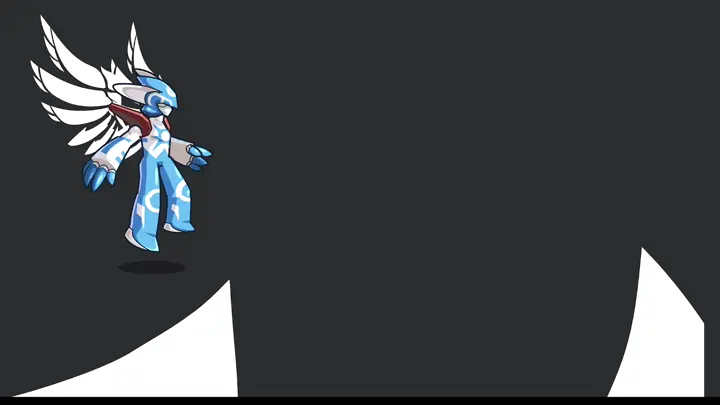
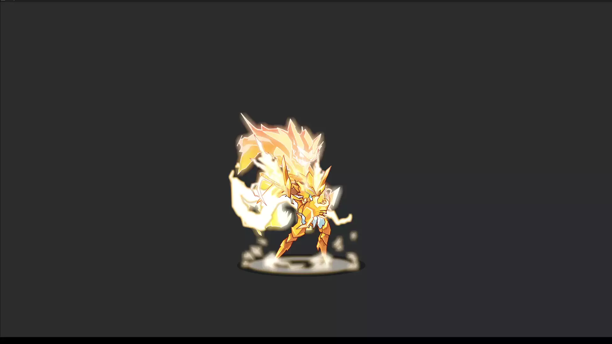

# Bevy Flash

[](https://github.com/aojiaoxiaolinlin/bevy_flash/#license)
[](https://crates.io/crates/bevy_flash)
[](https://crates.io/crates/bevy_flash)
[](https://deepwiki.com/aojiaoxiaolinlin/bevy_flash)
[](https://github.com/bevyengine/bevy/blob/main/docs/plugins_guidelines.md#main-branch-tracking)
[](https://discord.gg/aDzUKVE4)

English | [中文](./README.zh_CN.md)

Bring Flash animations into the Bevy game engine, fully WASM compatible!

## ✨ Features

- ✅ Animation control (pause / seek / loop etc.)  

### Blend Modes
- ✅ Add
- ✅ Subtract
- ✅ Screen
- ✅ Lighten
- ✅ Darken
- ✅ Multiply
- 🟡 Remaining blend modes require the screen texture feature from  `Bevy`

### Filter Rendering
- ✅ Color Transform Filter
- ✅ Blur Filter
- ✅ Glow Filter
- ✅ Bevel Filter
- 🟡 Remaining filters are pending implementation

## Goals

I want to bring Flash animations into the game engine to reuse old resources and thereby reconstruct Flash web games!


## 📸 Example
[See online demo](https://aojiaoxiaolinlin.github.io/bevy_flash_demo/)





## 🚀 Quick Start

### 1. Run the example

```bash
git clone https://github.com/aojiaoxiaolinlin/bevy_flash.git
cd bevy_flash
cargo run --example sample
```

### 2. Add bevy_flash to your project

Minimal usage:

```rust
fn setup(mut commands: Commands, assert_server: Res<AssetServer>) {
    commands.spawn(Camera2d);
    commands.spawn((
        Flash(assert_server.load("spirit2159src.swf")),
        FlashPlayer::from_animation_name("WAI").with_loop(true),
        Transform::from_scale(Vec3::splat(2.0)),
    ));
    commands.spawn(Flash(assert_server.load("loading_event_test.swf")));
}
```

## Compatibility
|bevy|bevy_flash|
|--|--|
|0.17|0.1|


## Contributing
If you also want to complete this plugin, you are welcome to submit a Pull Request (PR) or raise an issue.  

## License

This code is licensed under dual MIT / Apache-2.0 but with no attribution necessary. All contributions must agree to this licensing.
