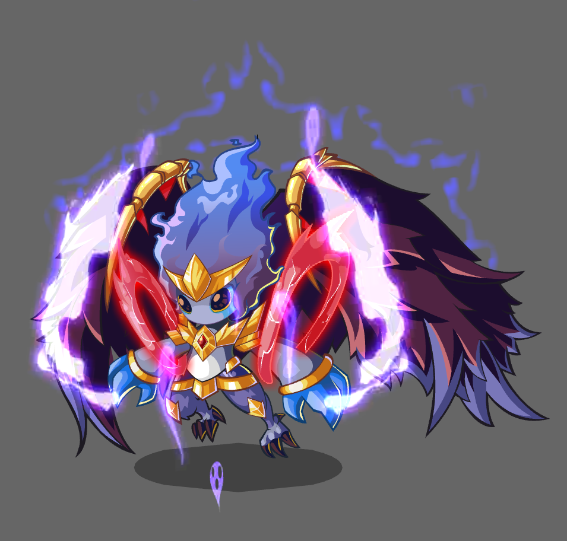

# Bevy Flash

[](https://github.com/aojiaoxiaolinlin/bevy_flash/#license)
[](https://crates.io/crates/bevy_flash)
[](https://crates.io/crates/bevy_flash)
[](https://deepwiki.com/aojiaoxiaolinlin/bevy_flash)
[](https://github.com/bevyengine/bevy/blob/main/docs/plugins_guidelines.md#main-branch-tracking)
[](https://discord.gg/aDzUKVE4)

Bring Flash animations into the Bevy game engine, fully WASM compatible!


面向 Bevy 的 Flash 矢量动画和 UI 库。SWF 由 [vatf](https://github.com/aojiaoxiaolinlin/vatf) 提前编译为 VAB；运行时加载烘焙帧，不解释 ActionScript，也不计算普通 Sprite 时间轴。

核心功能已实现，仍处于开发阶段，VAB 工作版本为 1，尚未发布稳定格式与 API。
它提供视觉动画资源播放，不执行 ActionScript 或 Flash 游戏逻辑。

## 渲染展示

以下是已有 GPU 测试直接渲染与读回的图片，保留透明背景，不是 JPEXS 导出的 PNG。
静态截图展示某一帧。

### 角色动画、位图与滤镜



`spirit2159src` 的单帧输出；Lighten 使用当前的 Max 近似。

### 静态与动态矢量 UI


名字框由矢量资源绘制，SWF 的可编辑文字被移除，玩家名字由宿主 Bevy UI 提供。


`background551284.swf#sparkles` 的一个动画帧，子时间轴已离线展开。

### 原生按钮状态

| 普通 up | 悬停 over | 按下 down |
|---|---|---|
|  |  |  |

SWF 的 hit 是命中几何，不是点击或焦点外观。截图来源与重新生成方法见 [图片说明](docs/images/README.md)。

## 已实现功能

| 功能 | 当前实现 |
|---|---|
| 图形 | 实色、渐变、位图、烘焙 Morph 网格、嵌套 alpha 遮罩 |
| 滤镜 | Blur、Glow、ColorMatrix、DropShadow、Bevel、Convolution、GradientGlow、GradientBevel |
| 混合 | Normal、Layer、Add、Subtract、Screen；Lighten 为 Max 近似 |
| 动画控制 | 根标签动作、帧事件、循环/单次、动作队列、fallback、终止播放锁定、暂停/速度/定位 |
| 换肤与文本 | 具名皮肤；普通动画的静态 DefineText/DefineText2 烘焙为字形图形 |
| 矢量 UI | ExportAssets 子资产、静态/动态 UI、原生按钮、比例布局与栅格缓存 |
| 导入 | vatf CLI、可选 Bevy SWF→VAB 预处理、引用裁剪与热重载 |
| 资源复用 | 帧内中间纹理复用、尺寸分级、驻留预算、容量增长式 GPU 缓冲与可选诊断 |

## 使用与示例

宿主加入 `FlashPlayerPlugin`，加载 `.vab`，由 `VabPlayer` 控制根动画。每个可见动画作为一个整体进入 Camera2d 的 `Transparent2d` 排序。相机上的 `Msaa` 控制世界动画抗锯齿；`CompositingSpace::Srgb` 用于 Flash 风格的颜色合成。

### 世界动画最小用法

把已转换的文件放入宿主 `assets/` 目录：

```rust
use bevy::prelude::*;
use bevy_flash::{
    FlashPlayerPlugin,
    vab_asset::VabAssetHandle,
    vab_player::VabPlayer,
};

fn main() {
    App::new()
        .add_plugins((DefaultPlugins, FlashPlayerPlugin))
        .add_systems(Startup, setup)
        .run();
}

fn setup(mut commands: Commands, assets: Res<AssetServer>) {
    commands.spawn((Camera2d, CompositingSpace::Srgb, Msaa::Sample4));
    commands.spawn((
        VabAssetHandle(assets.load("spirit2159src.vab")),
        VabPlayer::default(),
        Transform::default(),
    ));
}
```

默认播放器循环首个动作，等待资产加载后开始推进。实体与相机的 `Transform` 由宿主设置；
插件不按每帧 bounds 自动居中。Flash 的 Y 向下在世界显示时转换为 Y 向上。
不同素材的注册点可能不同，预览定位可参考 `show_demo` 和 [坐标文档](docs/coordinates-and-origin.md)。

取得已加载的 `VabAsset` 后可以控制播放和换肤：

```rust,ignore
// 名称仅作示例，须使用资源实际的动作、槽和变体名。
player.set_fallback_loop(asset, "idle")?;
player.play_once(asset, "attack")?; // 播完自动回到 idle
player.play_once(asset, "skill_start")?
    .then_once(asset, "skill_end")?
    .then_loop(asset, "idle")?;
player.play_terminal(asset, "death")?; // 播完保持末帧并锁定，不回到 idle
// 复活时显式解除锁定：player.reset_terminal();
skin.set(asset, "hand", "red_armor")?;
```

fallback 需要显式指定。通过 `MessageReader<VabFrameEvent>` / `MessageReader<VabCompleteEvent>`
消费事件；动画链不需要宿主监听完成事件来手动跳转。完整 API 见 [播放文档](docs/playback-api.md)。

### 矢量 UI 最小用法

矢量 UI 另加 `VabUiPlugin`：

```rust
use bevy::prelude::*;
use bevy_flash::{FlashPlayerPlugin, vab_ui::{VabButtonNode, VabImageNode, VabUiPlugin}};

fn setup(mut commands: Commands, assets: Res<AssetServer>) {
    commands.spawn(Camera2d);
    commands.spawn((
        VabImageNode::new(assets.load("nameplate3.vab#name_kuang")),
        Node { width: px(240), ..default() },
    ));
    commands.spawn((
        VabButtonNode::new(assets.load("login.vab#login_button")),
        Node { width: px(180), ..default() },
    ));
}

fn main() {
    App::new()
        .add_plugins((DefaultPlugins, FlashPlayerPlugin, VabUiPlugin))
        .add_systems(Startup, setup)
        .run();
}
```

UI 导出名来自 SWF 的 `ExportAssets`。只指定宽度时，高度按资源比例测量；静态 UI、动态 UI 和按钮都复用同一个矢量渲染器及尺寸缓存。新图片绘制完成前保留上一张画面。按钮由 Bevy `Interaction` 选择 `up/over/down`，业务事件仍由宿主处理。

同时指定宽高时默认 Contain 保持比例；需要变形时才使用 `VabImageFit::Stretch`。
动态导出同样使用 `VabImageNode`，通过 `VabUiPlayback` 控制暂停和速度。
也可用类型化标签，如 `VabAssetLabel::Graphic("sparkles").from_asset("background.vab")`。

### 可运行示例

以下命令在本库目录执行；效果取决于示例当前选择的素材和动作名。

| 示例命令 | 内容 |
|---|---|
| `cargo run --example spirit` | 简洁的世界动画播放 |
| `cargo run --example show_demo` | 动作切换、播放队列和 fallback |
| `cargo run --example wu_kong_skin` | 具名换肤 |
| `cargo run --example spirit_diagnostics` | CPU/GPU、缓存和纹理池诊断 |
| `cargo run --example ui_graphics` | 静态矢量 UI、尺寸与比例适配 |
| `cargo run --example animated_ui` | 含子动画的矢量 UI |
| `cargo run --example ui_buttons` | 原生 SWF 按钮；空格切换禁用 |
| `cargo run --features asset_processor --example processed_ui` | 直接加载 SWF，由 Bevy 编译、缓存和加载 UI 子资产 |

## SWF → VAB 导入

在 vatf 目录执行三种转换之一：

```powershell
cargo run --release -- "path/to/character.swf" -o "path/to/character.vab"
cargo run --release -- "path/to/ui.swf" --ui -o "path/to/ui.vab"
cargo run --release -- "path/to/background.swf" --ui-animated -o "path/to/background.vab"
```

- **动画**：根 MC 已是动画根，根与子帧长提前对齐；除 `event_` 外的根标签定义动作，
  `anim_` 是可选前缀，`event_` 定义帧事件。不进行根发现或补帧。
- **静态 UI**：用 ExportAssets 命名 Shape、静态 Sprite 或原生按钮，编译导出及其依赖。
- **动态 UI**：允许纯矢量子动画，离线烘焙共同循环周期，具体限制见 UI 文档。

编译器按最终全部动作、皮肤变体、遮罩与 UI 帧裁剪资源，同步重建偏移。
CLI 会报告裁剪前后的网格数和资源载荷大小。

### 可选 Bevy 资产预处理

启用本库 `asset_processor` feature，使用 `AssetMode::Processed` 并加入
`VabAssetProcessorPlugin`。普通动画默认按 Animation 处理；UI 在 `.swf.meta` 中
指定 StaticUi 或 AnimatedUi。然后直接加载 `character.swf` 或 `background.swf#sparkles`。

Bevy 管理源文件和配置失效；`vab_processed_asset_path` 按编译器修订号隔离缓存。
发布时关闭处理器，只分发处理后资源及生成的元数据，保留相同逻辑加载路径。
完整接入、热重载和发布步骤见 [资产预处理文档](docs/asset-processing.md)。

## 开发与验证

使用满足 Bevy 源码 `rust-version` 要求的 Rust 工具链，以及同级目录的 `../bevy`（版本见兼容性表）和 `../vatf`（编译器与读取器）。当前使用路径依赖，尚不能直接按 crates.io 版本安装。

```text
Rust/
├── bevy/
├── vatf/
└── bevy_flash/
```

vatf 的 UI 与共用编译接口已合入 `main`，本库使用该主分支的接口，无需切换旧的 UI 开发分支。开发期间更换 vatf 修订时，需保持接口与 VAB 工作格式配套；格式或编译行为改变后的产物应重新生成。

宿主项目按实际目录调整依赖路径：

```toml
[dependencies]
bevy = { path = "../bevy", default-features = false, features = ["2d", "ui_bevy_render"] }
bevy_flash = { path = "../bevy_flash" }
```

```powershell
cargo test --lib --tests
cargo test --features asset_processor --test asset_processing
cargo clippy --all-targets -- -D warnings
cargo fmt --check
cargo check --no-default-features --lib
```

默认 `ui` feature 启用 Bevy UI；只使用世界动画时可禁用默认 features。GPU 测试需要图形适配器，默认忽略，不会创建系统窗口：

```powershell
cargo test --test render_gpu ui:: -- --ignored --test-threads=1
cargo test --test render_gpu filters:: -- --ignored --test-threads=1
cargo test --test render_gpu instances:: -- --ignored --test-threads=1
```

`benchmarks::` 分组包含资源图像与性能基准；运行前查看测试自身的资源和耗时要求。
部分开发测试依赖同级 `bevy_flash/assets` 中的源 SWF，这些素材不是宿主使用插件的运行依赖。

## 文档与边界

- [架构与代码入口](docs/architecture.md)
- [播放 API 与动作链](docs/playback-api.md)
- [矢量 UI、动态 UI 和按钮](docs/vector-ui.md)
- [SWF 资产预处理与发布](docs/asset-processing.md)
- [坐标、原点与待定锚点方案](docs/coordinates-and-origin.md)
- [实现计划与验证记录](docs/implementation-plan.md)

支持 vatf 手动转换与可选的 Bevy 资产预处理；预处理后仍使用相同的 VAB 加载器。精确屏幕颜色混合、按钮精确命中和键盘焦点样式尚未实现。UI 暂限矢量资源；按钮状态暂限静态子树。完整限制与配置见对应文档。

## Compatibility

| Bevy | bevy_flash |
|---|---|
| 0.17 | 0.1 |
| 0.18 | 0.2 |
| 0.19 | 0.3（开发中） |

## 版权与第三方美术资产声明

本仓库中的源代码、文档等内容，除非另有说明，版权归 [本人] 所有，并依据 [MIT/Apache-2.0] 许可证授权。

本仓库中用于演示的美术资产，包括但不限于 `assets` 目录下的 SWF、PNG、JPG、GIF 等文件，版权归原作者所有。除非另有说明，这些美术资产仅用于本仓库的演示和测试目的，不得用于其他商业或非商业用途。
