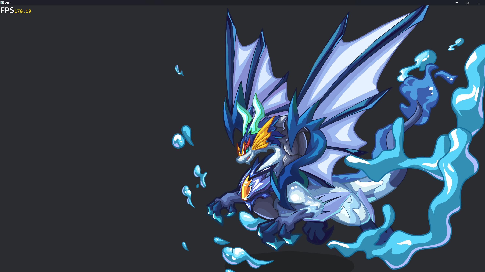

<div align="center">
    <h1>bevy_flash</h1>
    <span>English | <a href="./README.zh_CN.md">中文</a></span>
    <p><em>Bring Flash animations into the Bevy game engine, fully WASM compatible!</em></p>
    <br/>
    <a href="http://49.232.132.44/bevy-flash2/">
        
    </a>
    <a href="LICENSE">
        
    </a>
</div>

---

## ✨ Features
- ✅ Animation control (pause / seek / loop etc.)  
- 🟡 Blend rendering (partially supported, basic modes only)  
- 🟡 Filter rendering (partially supported, available in `filter_render_dev` branch)

## docs

访问 [中文文档](http://49.232.132.44/bevy-flash2/ "中文文档") | [文档源码](/docs "文档源码") 

## Goals

I want to bring Flash animations into the game engine to reuse old resources and thereby reconstruct Flash web games!


## 📸 Example
[See online demo](https://aojiaoxiaolinlin.github.io/bevy_flash_demo/)




## 🚀 Quick Start

### 1. Run the example

```bash
git clone https://github.com/aojiaoxiaolinlin/bevy_flash.git
cd bevy_flash
cargo run --example sample
```

### 2. Add bevy_flash to your project

```toml
[dependencies]
bevy_flash = { git = "https://github.com/aojiaoxiaolinlin/bevy_flash.git" }
```
Minimal usage:

```rust
fn setup(mut commands: Commands, assert_server: Res<AssetServer>) {
    commands.spawn((Camera2d, Msaa::Sample8));
    commands.spawn((
        Name::new("冲霄"),
        Flash(assert_server.load("spirit2159src.swf")),
        FlashPlayer::from_animation_name("WAI"),
        Transform::from_scale(Vec3::splat(2.0)),
    ));

    commands.spawn((
        Flash(assert_server.load("埃及太阳神.swf")),
        Transform::from_scale(Vec3::splat(2.0)),
    ));

    commands.spawn(Flash(assert_server.load("loading_event_test.swf")));
}
```


> [!TIP]
> The filter effects are currently available in the `filter_render_dev` branch. Since I've modified some of the source code, you'll need to pull my [branch](https://github.com/aojiaoxiaolinlin/bevy/tree/bevy_flash_modify).

> [!WARNING]
> This project is still in the early stages of development.


## Contributing
If you also want to complete this plugin, you are welcome to submit a Pull Request (PR) or raise an issue.  

## License

This code is licensed under dual MIT / Apache-2.0 but with no attribution necessary. All contributions must agree to this licensing.
