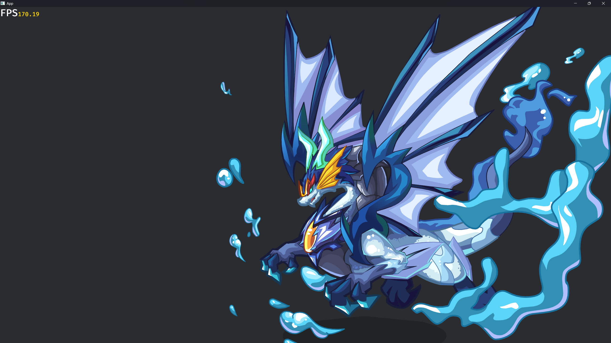
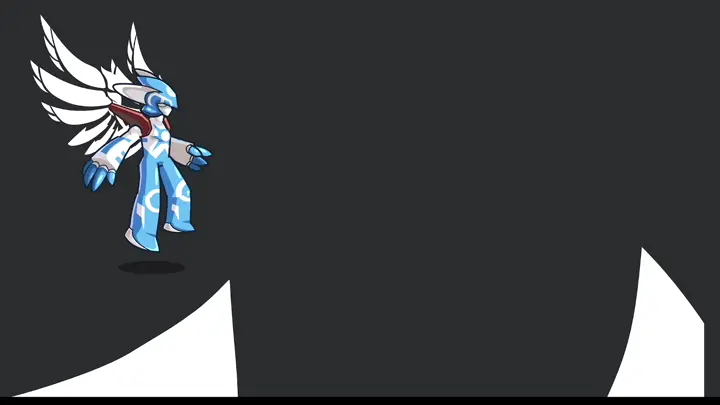
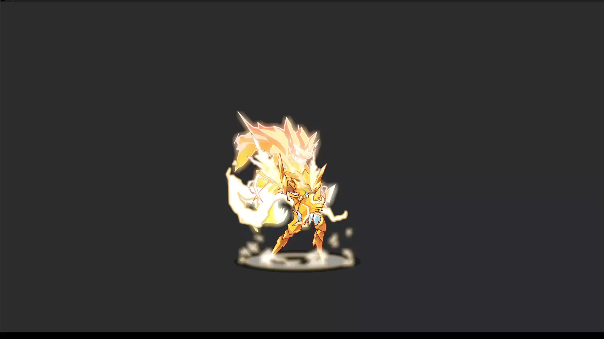

# Bevy Flash

[](https://github.com/aojiaoxiaolinlin/bevy_flash/#license)
[](https://crates.io/crates/bevy_flash)
[](https://crates.io/crates/bevy_flash)
[](https://deepwiki.com/aojiaoxiaolinlin/bevy_flash)
[](https://github.com/bevyengine/bevy/blob/main/docs/plugins_guidelines.md#main-branch-tracking)
[](https://discord.gg/aDzUKVE4)

[English](./README.md) | 中文
将 Flash 动画引入 Bevy 引擎，兼容 WASM！

## 目标

我希望将 Flash 动画引入 Bevy 游戏引擎，焕发新生！

## ✨ 特性

- ✅ 动画播放控制（暂停/跳转/循环等）

### 混合模式 
- ✅ 增加
- ✅ 减去
- ✅ 滤色
- ✅ 变亮
- ✅ 变暗
- ✅ 正片叠底
- 🟡 其余混合模式需要等待`Bevy`提供获取屏幕纹理功能

> [!NOTE]
> 由于 GPU 进行混合运算时采用的是线性空间（Linear Space），而 Flash 默认的混合模式是在伽马空间（Gamma Space 或 sRGB Space）进行的，
> 因此当前实现的混合模式颜色在颜色准确性上存在一定的差异。

### 滤镜渲染
- ✅ 颜色变换滤镜
- ✅ 模糊滤镜
- ✅ 发光滤镜
- ✅ 斜角滤镜
- 🟡 其余滤镜，待实现

## 📸 预览

> 在线 [Demo](https://aojiaoxiaolinlin.github.io/bevy_flash_demo/)






## 🚀 快速开始

### 1. 运行示例
```bash
git clone https://github.com/aojiaoxiaolinlin/bevy_flash.git
cd bevy_flash
cargo run --example sample
```

### 2. 在项目中使用

```rust
fn setup(mut commands: Commands, assert_server: Res<AssetServer>) {
    commands.spawn(Camera2d);
    commands.spawn((
        Name::new("冲霄"),
        Flash(assert_server.load("spirit2159src.swf")),
        FlashPlayer::from_animation_name("WAI"),
        Transform::from_scale(Vec3::splat(2.0)),
    ));

    commands.spawn((
        Flash(assert_server.load("埃及太阳神.swf")),
        Transform::from_scale(Vec3::splat(2.0)),
    ));

    commands.spawn(Flash(assert_server.load("loading_event_test.swf")));
}
```

## 兼容性
|bevy|bevy_flash|
|--|--|
|0.17|0.1|
|0.18|0.2|

## 🤝 贡献

欢迎 Issue、PR、讨论！
所有贡献默认接受 MIT / Apache-2.0 双许可证，无需额外署名。

## 📄 许可证
MIT 或 Apache-2.0 任选其一，详见 LICENSE。
