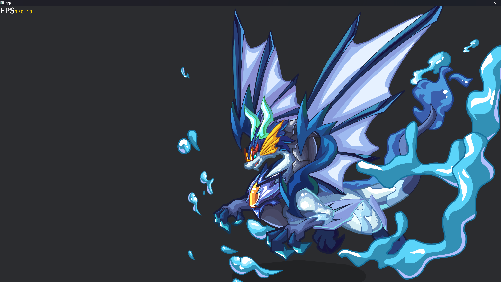

# bevy_flash

## Rendering flash animation in bevy engine

## Example

[See online demo](https://aojiaoxiaolinlin.github.io/bevy_flash_demo/)

- run example

```bash
cargo run --package bevy_flash --example sample
```




> Reference [Ruffle](https://github.com/ruffle-rs/ruffle/);

## Support

- [x] Shape Render
- [x] MovieClip Animation
- [x] Control Animation
- [ ] Blend Render
- [ ] Filter Render

## License

This code is licensed under dual MIT / Apache-2.0 but with no attribution necessary. All contributions must agree to this licensing.
